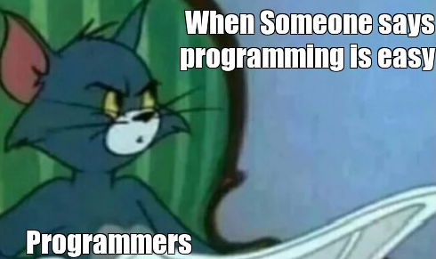

<p align="center">
  
</p>

<div id="header" align="center">
  
</div>

<hr>

<h3 align="center"> Languages & Tools :pen:</h3>
<p align="center">
  &nbsp;
  &nbsp;
  &nbsp;
  &nbsp;
  &nbsp;
  &nbsp;
  
</p>
<p align="center">
  &nbsp;
  &nbsp;
  &nbsp;
  
</p>


<h3 align="center"> :bar_chart: The time I spent immersed in these language :</h3>
<!--START_SECTION:waka-->

```txt
PHP          14 hrs 7 mins         ██████████████░░░░░░░░░░░   55.46 %
TypeScript   3 hrs 1 min           ███░░░░░░░░░░░░░░░░░░░░░░   11.90 %
Markdown     2 hrs 12 mins         ██░░░░░░░░░░░░░░░░░░░░░░░   08.64 %
Python       2 hrs 4 mins          ██░░░░░░░░░░░░░░░░░░░░░░░   08.16 %
Go           1 hr 27 mins          █▒░░░░░░░░░░░░░░░░░░░░░░░   05.69 %
```

<!--END_SECTION:waka-->